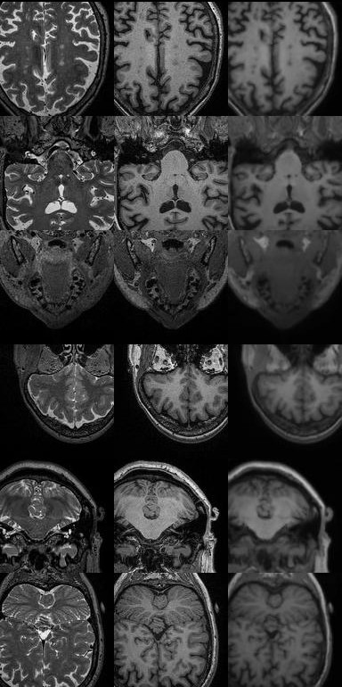
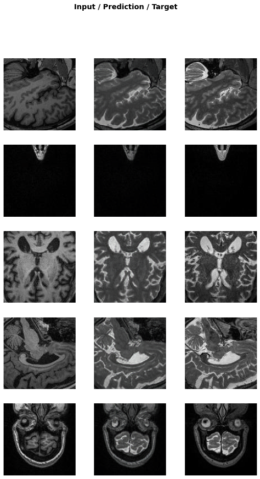

# T1ify

The aim of T1ify is to transform non T1 weighted MR images to have a similar contrast profile to an adult T1 image.  
The main goal is to not only improve rgistration results by increasing mutual information, but also to allow for datasets lacking T1 images to have cortical reconstruction in freesurfer like cortical surface pipelines.  
T1ify is a learning project as much as a goal oriented project to create a really useful tool. Feel free to join if you want to learn by doing and convert those other modalities to T1s! Join our  channel for brainstorming & discussions.

# Required Skills
This is an open learning project meaning that anyone can join and contribute! 
However it may be useful to be familiar with at least some of the following: 

- Neuroimaging
- Python
- Deep Learning

Join our channel on  

#### First outputs during testing of different approaches
Left: T2 -- T1 -- T1 predicted; Right:T1 -- T2 predicted -- T2   
 

## Set up
We are using git submodules for external tools which we store inside the `bin` directory. After you forked and cloned the repository, do  
`cd T1ify`  
`git submodule init`  
`git submodule update`  
`cd bin/volume`  
`source compile.sh`  

## Some references & inspirations

#### Papers & Blog posts  
* **[Generating MRI Images of Multi-Contrast.](https://towardsdatascience.com/generating-mri-images-of-multiple-contrast-levels-89c3b6c00e68)**   Leveraging CycleGans to translate T1-weighted MRI images to T2-weighted MRI images. (Blog post by Joey Mach)
* **[Attention-Aware Discrimination for MR-to-CT Image Translation Using Cycle-Consistent Generative Adversarial Networks.](https://pubs.rsna.org/doi/10.1148/ryai.2020190027)** (Paper by Kearny et al.)
* **[Synthesized b0 for diffusion distortion correction (Synb0-DisCo).](https://doi.org/10.1016/j.mri.2019.05.008)** (Paper by Schillig et al.)
* **[Image Synthesis in Multi-Contrast MRI with
Conditional Generative Adversarial Networks.](https://arxiv.org/pdf/1802.01221.pdf)** (Paper by Dar et al.)
* **[DeepFCD: Detect focal cortical dysplasias using a generative modelling approach](https://github.com/bastiandavid/DeepFCD)** (GitHub repo with inspirations, code not yet; David et al.)  
GAN based on pix2pix, output example [here](https://github.com/bastiandavid/DeepFCD/blob/master/assets/example_outputs/T1_FLAIR_SYNTH_01.gif)
* **[Visualizing 150000 butterflies from the Natural History Museum](https://marian42.de/article/butterflies/)** (Blog post by Kleineberg)

#### Papers with code repositories & code repos
* **[mri2mri: convert one type of MRI to another](https://github.com/uw-biomedical-ml/mri2mri)** (GitHub repo by Rokem et al)
* **[Generative Adversarial Networks for Image-to-Image Translation on Multi-Contrast MR Images - A Comparison of CycleGAN and UNIT.](https://arxiv.org/abs/1806.07777)** (Welander et al.); GitHub repo: [simontomaskarlsson
/
GAN-MRI](https://github.com/simontomaskarlsson/GAN-MRI).
* **["Oldify for Brains": what will your brain look like in 40 years?
Neurohackademy project: deep learing and GANs](https://github.com/jeffreydurieux/neurohack_dl_gan)** (GitHub repo by Durieux)

#### For learning
* **[Implementation of deep learning framework -- Unet, using Keras](https://github.com/zhixuhao/unet)**, The architecture was inspired by U-Net: Convolutional Networks for Biomedical Image Segmentation. (GitHub repo by Zhixu)
* **[How to load nib to PyTorch](https://discuss.pytorch.org/t/how-to-load-nib-to-pytorch/40947)** 

